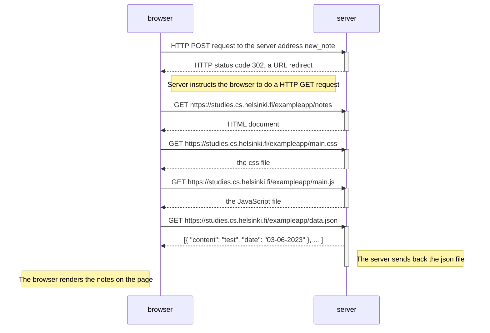

```mermaid
sequenceDiagram
     participant browser
     participant server
     
     browser->>server: HTTP POST request to the server address new_note
     activate server
     server-->>browser: HTTP status code 302, a URL redirect
    deactivate server
    Note right of browser: Server instructs the browser to do a HTTP GET request
    
    browser->>server: GET https://studies.cs.helsinki.fi/exampleapp/notes
    activate server
    server-->>browser: HTML document
    deactivate server
   
    browser->>server: GET https://studies.cs.helsinki.fi/exampleapp/main.css
    activate server
    server-->>browser: the css file
    deactivate server

    browser->>server: GET https://studies.cs.helsinki.fi/exampleapp/main.js
    activate server
    server-->>browser: the JavaScript file
    deactivate server
    
    browser->>server: GET https://studies.cs.helsinki.fi/exampleapp/data.json
    activate server
    server-->>browser: [{ "content": "test", "date": "03-06-2023" }, ... ]
    Note right of server: The server sends back the json file
    deactivate server
    
    Note left of browser: The browser renders the notes on the page
    
```
