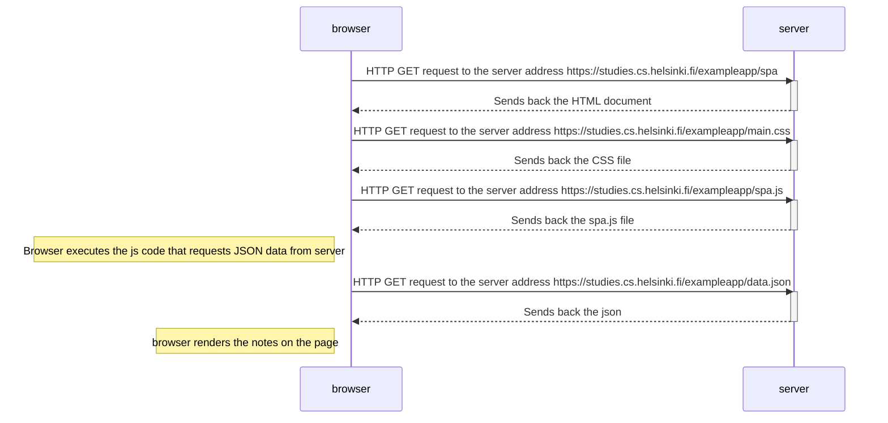

```mermaid
sequenceDiagram
     participant browser
     participant server
     
     browser->>server: HTTP GET request to the server address https://studies.cs.helsinki.fi/exampleapp/spa
     activate server
     server-->>browser: Sends back the HTML document
     deactivate server
     
     browser->>server: HTTP GET request to the server address https://studies.cs.helsinki.fi/exampleapp/main.css
     activate server
     server-->>browser: Sends back the CSS file
     deactivate server
    
     browser->>server: HTTP GET request to the server address https://studies.cs.helsinki.fi/exampleapp/spa.js
     activate server
     server-->>browser: Sends back the spa.js file
     deactivate server
     
     Note left of browser: Browser executes the js code that requests JSON data from server
     browser->>server: HTTP GET request to the server address https://studies.cs.helsinki.fi/exampleapp/data.json
     activate server
     server-->>browser: Sends back the json
     deactivate server
     
     Note left of browser: browser renders the notes on the page
     
    
```
