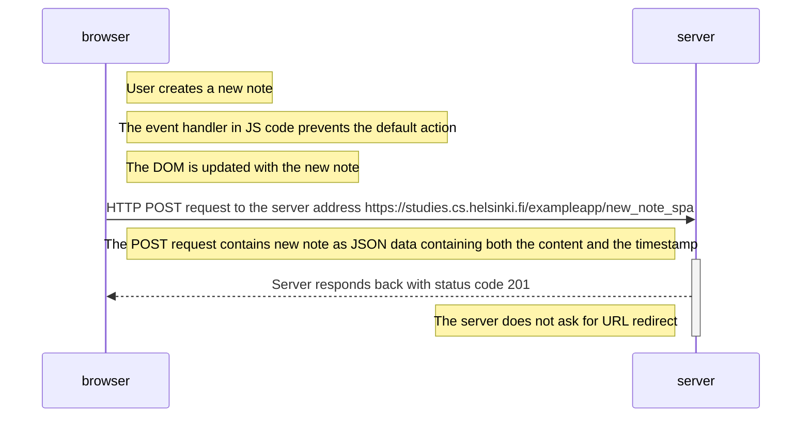

```mermaid
sequenceDiagram
     participant browser
     participant server
     
     Note right of browser: User creates a new note
     Note right of browser : The event handler in JS code prevents the default action
     Note right of browser : The DOM is updated with the new note
     
     
     browser->>server: HTTP POST request to the server address https://studies.cs.helsinki.fi/exampleapp/new_note_spa
      Note right of browser: The POST request contains new note as JSON data containing both the content and the timestamp 
     activate server
     server-->>browser: Server responds back with status code 201
     Note left of server: The server does not ask for URL redirect
    
    deactivate server
    

     
   
    
```
